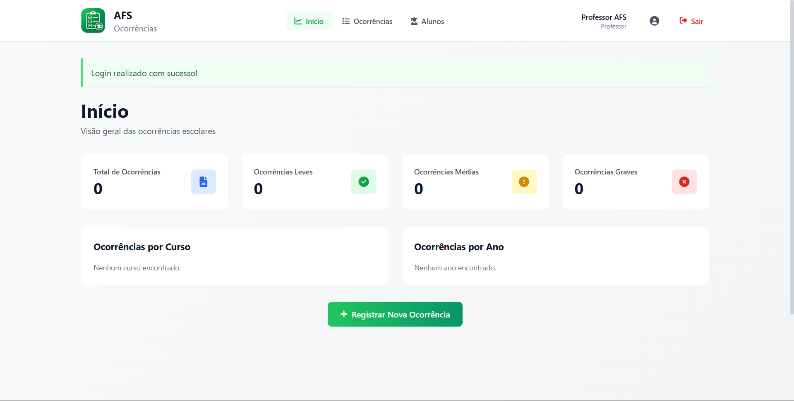

# Sistema de Ocorrências Escolares AFS

## Visão Geral



##📋 Descrição

Sistema web para gestão de ocorrências escolares, desenvolvido para facilitar o registro, acompanhamento e análise de incidentes disciplinares de alunos em instituições de ensino. O projeto oferece uma interface moderna, responsiva e intuitiva, com dashboard administrativo, filtros, relatórios visuais e funcionalidades de cadastro, edição, detalhamento e exclusão de ocorrências.

A solução foi criada com Python e Flask, seguindo uma arquitetura organizada por módulos, com foco em usabilidade, produtividade e manutenção do código. É ideal para escolas que desejam centralizar o controle de ocorrências, acompanhar padrões por gravidade, curso e ano, e manter um histórico organizado de forma prática e segura.

## 🎯 Funcionalidades Principais

✅ **Dashboard Interativo**
- Visão geral com estatísticas em tempo real
- Cards informativos por gravidade
- Gráficos de ocorrências por curso e ano
- Interface moderna e responsiva

✅ **Cadastro de Ocorrências**
- Formulário intuitivo com validações
- Campos: Nome, Curso, Ano, Data, Descrição, Gravidade, Observações
- Feedback visual em tempo real
- Mensagens de sucesso/erro elegantes

✅ **Listagem e Filtros**
- Tabela moderna e responsiva
- Busca dinâmica por nome de aluno
- Filtros por: Curso, Ano, Gravidade
- Paginação automática
- Ordenação por data

✅ **Detalhamento**
- Visualização completa da ocorrência
- Informações formatadas e elegantes
- Modal de impressão
- Ações rápidas

✅ **Edição**
- Atualização de dados sem recarregar página
- Validações em tempo real
- Campos imutáveis para integridade
- Histórico de alterações

✅ **Exclusão Segura**
- Modal de confirmação
- Exclusão permanente com segurança
- Backup de dados em JSON

✅ **Extras**
- Toast notifications modernas
- Loading animations
- Empty states profissionais
- Confirmações elegantes
- Responsividade 100% (Desktop, Tablet, Mobile)

## 🛠️ Tecnologias

**Backend:**
- Python 3.8+
- Flask 2.3.3
- Jinja2 (Templates)
- JSON (Persistência)

**Frontend:**
- HTML5
- CSS3 (Tailwind CSS via CDN)
- JavaScript (Vanilla)
- Font Awesome Icons
- Google Fonts (Inter)

**Arquitetura:**
- MVC Pattern
- Flask Blueprints
- Separação de responsabilidades
- Logging profissional

## 📁 Estrutura do Projeto

```
SistemaOcorrencias/
├── app.py                      # Aplicação principal
├── requirements.txt            # Dependências Python
├── README.md                   # Este arquivo
│
├── routes/                     # Blueprints de rotas
│   ├── __init__.py
│   ├── dashboard.py           # Dashboard
│   └── ocorrencias.py         # CRUD de ocorrências
│
├── templates/                  # Templates Jinja2
│   ├── base.html              # Layout base
│   ├── dashboard/
│   │   └── index.html         # Dashboard
│   ├── ocorrencias/
│   │   ├── criar.html         # Criar ocorrência
│   │   ├── listar.html        # Listagem
│   │   ├── detalhes.html      # Detalhes
│   │   └── editar.html        # Editar
│   └── errors/
│       ├── 404.html
│       └── 500.html
│
├── static/                     # Arquivos estáticos
│   ├── css/
│   │   └── style.css          # Estilos personalizados
│   ├── js/
│   │   ├── utils.js           # Utilidades gerais
│   │   ├── notifications.js   # Sistema de notificações
│   │   └── ocorrencias.js     # Scripts de ocorrências
│   └── img/                   # Imagens
│
├── services/                   # Lógica de negócio
│   ├── __init__.py
│   └── ocorrencias_service.py # Serviço de ocorrências
│
├── utils/                      # Utilidades
│   ├── __init__.py
│   ├── logger.py              # Sistema de logging
│   ├── validators.py          # Validações
│   ├── json_handler.py        # Gerenciamento JSON
│   └── helpers.py             # Funções auxiliares
│
└── data/                       # Dados
    └── ocorrencias.json       # Persistência de dados
```

## 🚀 Como Iniciar

### 1️⃣ Pré-requisitos

- Python 3.8 ou superior
- pip (gerenciador de pacotes Python)

### 2️⃣ Instalação

```bash
# Clonar ou extrair o projeto
cd SistemaOcorrencias

# Criar ambiente virtual (opcional, mas recomendado)
python -m venv venv

# Ativar ambiente virtual
# No Windows:
venv\Scripts\activate
# No Linux/Mac:
source venv/bin/activate

# Instalar dependências
pip install -r requirements.txt
```

### 3️⃣ Executar a Aplicação

```bash
# Iniciar servidor Flask
python app.py

# A aplicação estará disponível em:
# http://localhost:5000
```

### 4️⃣ Acessar o Sistema

- **URL Principal:** http://localhost:5000
- **Dashboard:** http://localhost:5000/
- **Ocorrências:** http://localhost:5000/ocorrencias
- **Nova Ocorrência:** http://localhost:5000/ocorrencias/criar

## 🎨 Design e UX

### Paleta de Cores
- **Verde Primário:** #10b981 (Profissional e confiável)
- **Laranja Secundário:** #f97316 (Destaque e ação)
- **Backgrounds:** Tons suaves de cinza e branco
- **Efeitos:** Glassmorphism, sombras suaves, bordas arredondadas

### Interface
- Cards com hover effects elegantes
- Tipografia sofisticada (Inter)
- Espaçamento profissional
- Animações suaves
- Responsividade total

## 📊 Validações

### Entrada de Dados
- ✅ Sanitização de inputs
- ✅ Validação de comprimento
- ✅ Validação de formato
- ✅ Validação de datas (não futuras)
- ✅ Validação de campos obrigatórios

### Segurança
- ✅ Proteção contra XSS
- ✅ Validação server-side
- ✅ Tratamento de exceções
- ✅ Logging de operações
- ✅ CSRF protection pronto para implementação

## 📝 Campos de Ocorrência

| Campo | Tipo | Validação | Obrigatório |
|-------|------|-----------|------------|
| Nome Aluno | Texto | 3-100 caracteres | Sim |
| Curso | Select | Informática, Eletrônica, Mecânica, Administração | Sim |
| Ano | Select | 1º, 2º, 3º | Sim |
| Data | Date | Não futura | Sim |
| Descrição | Textarea | 10-1000 caracteres | Sim |
| Gravidade | Select | Leve, Média, Grave | Sim |
| Observações | Textarea | 0-500 caracteres | Não |

## 🔍 Endpoints da API

### Dashboard
- `GET /` - Dashboard inicial

### Ocorrências (Web)
- `GET /ocorrencias/` - Listar ocorrências
- `GET /ocorrencias/criar` - Formulário de criação
- `POST /ocorrencias/criar` - Salvar nova ocorrência
- `GET /ocorrencias/<id>` - Detalhes da ocorrência
- `GET /ocorrencias/<id>/editar` - Formulário de edição
- `POST /ocorrencias/<id>/editar` - Atualizar ocorrência

### API (JSON)
- `POST /ocorrencias/api/criar` - Criar via AJAX
- `PUT /ocorrencias/api/<id>/atualizar` - Atualizar via AJAX
- `DELETE /ocorrencias/api/<id>/deletar` - Deletar via AJAX
- `GET /ocorrencias/api/filtrar` - Filtrar em tempo real

## 📊 Estatísticas

O sistema captura e exibe:
- Total de ocorrências
- Ocorrências por gravidade (Leve, Média, Grave)
- Ocorrências por curso
- Ocorrências por ano
- Gráficos visuais em tempo real

## 🔐 Segurança

- ✅ Validação de entrada em todos os formulários
- ✅ Sanitização de dados
- ✅ Proteção contra SQL injection (via JSON)
- ✅ Proteção contra XSS
- ✅ Logging de operações críticas
- ✅ Tratamento de erros seguro

## 📱 Responsividade

- ✅ Desktop (1920px+)
- ✅ Laptop (1366px - 1919px)
- ✅ Tablet (768px - 1365px)
- ✅ Mobile (320px - 767px)

## 🎯 Melhorias Futuras

- [ ] Autenticação de usuários
- [ ] Perfis de acesso (Professor, Coordenador, Admin)
- [ ] Banco de dados (PostgreSQL)
- [ ] Relatórios em PDF
- [ ] Exportação para Excel
- [ ] Notificações por email
- [ ] Sistema de backup automático
- [ ] API Rest completa
- [ ] Integração com sistema escolar
- [ ] Dark mode

## 🐛 Troubleshooting

### Erro: "ModuleNotFoundError: No module named 'flask'"
```bash
pip install -r requirements.txt
```

### Erro: "Port 5000 already in use"
```bash
# Windows
netstat -ano | findstr :5000
taskkill /PID <PID> /F

# Linux/Mac
lsof -i :5000
kill -9 <PID>
```

### Arquivo JSON não encontrado
O arquivo é criado automaticamente na primeira execução em `data/ocorrencias.json`.

## 👨‍💻 Desenvolvedor

Sistema desenvolvido com padrões profissionais de engenharia de software, arquitetura robusta e experiência full-stack senior.

## 📄 Licença

Todos os direitos reservados - EEEP Adolfo Ferreira de Sousa 

## 🤝 Suporte

Para dúvidas ou sugestões sobre o sistema, entre em contato com a administração.

---

**Desenvolvido com ❤️ por Matheus-Jaco**
